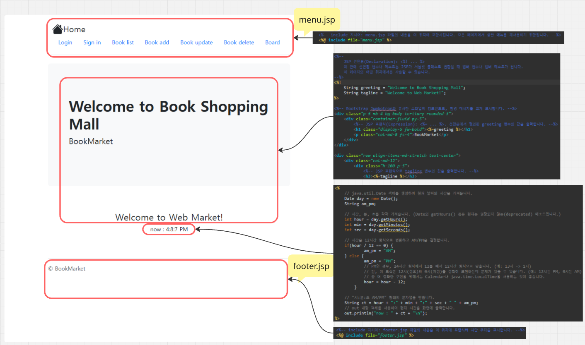

# BookMarket Project
## 목차
1. [BookMarket's Sturcture](#1-BookMarket's-Sturcture)
2. [welcome.jsp](#2-welcome.jsp)

 

3. [Code Analysis](#3-Code-Analysis)

## 1.BookMarket's Sturcture

## 2.welcome.jsp - menu.jsp, footer.jsp


## 3.Code Analysis

```jsp
<%-- page 지시어: 이 JSP 페이지의 전반적인 속성을 정의합니다. --%>
<%@ page import="java.util.*" %> <%-- import 속성: java.util 패키지의 모든 클래스를 이 페이지에서 사용할 수 있도록 가져옵니다. --%>
<%@ page language="java" contentType="text/html; charset=UTF-8"
    pageEncoding="UTF-8"%>
<!DOCTYPE html>
<html>
<head>
	<%-- Bootstrap CSS CDN을 포함하여 웹 페이지의 디자인을 꾸밉니다. --%>
	<link rel="stylesheet" href="https://cdn.jsdelivr.net/npm/bootstrap@5.3.1/dist/css/bootstrap.min.css">
<meta charset="UTF-8">
<title>Welcome</title>
</head>
<body>
	<%-- Bootstrap container 클래스로 전체 콘텐츠를 감싸 정렬과 패딩을 적용합니다. --%>
	<div class="container py-4">
		<%-- include 지시어: menu.jsp 파일의 내용을 이 위치에 포함시킵니다. 모든 페이지에서 상단 메뉴를 재사용하기 위함입니다. --%>
		<%@ include file="menu.jsp" %> 
		
    	<%-- 
    		JSP 선언문(Declaration): <%! ... %>
    		이 안에 선언된 변수나 메소드는 JSP가 서블릿 클래스로 변환될 때 멤버 변수나 멤버 메소드가 됩니다.
    		이 페이지의 어떤 위치에서든 사용할 수 있습니다.
    	--%>
    	<%! 
    		String greeting = "Welcome to Book Shopping Mall";
    		String tagline = "Welcome to Web Market!";
    	%>
    	
    	<%-- Bootstrap Jumbotron과 유사한 스타일의 컴포넌트로, 환영 메시지를 크게 표시합니다. --%>
    	<div class="p-5 mb-4 bg-body-tertiary rounded-3">
    		<div class="container-fluid py-5">
    			<%-- JSP 표현식(Expression): <%= ... %>. 선언문에서 정의한 greeting 변수의 값을 출력합니다. --%>
    			<h1 class="display-5 fw-bold"><%=greeting %></h1>
    			<p class="col-md-8 fs-4">BookMarket</p>
    		</div>
    	</div>
    	
    	<div class="row align-items-md-stretch text-center">
    		<div class="col-md-12">
    			<div class="h-100 p-5">
    				<%-- JSP 표현식으로 tagline 변수의 값을 출력합니다. --%>
    				<h3><%=tagline %></h3>
    				<%-- 
    					JSP 스크립틀릿(Scriptlet): <% ... %>
    					이 안에 자바 코드를 작성할 수 있습니다.
    					JSP가 서블릿으로 변환될 때, 이 코드는 _jspService() 메소드 안에 위치하게 됩니다.
    					여기서는 현재 시간을 계산하고 출력하는 로직을 수행합니다.
    				--%>
    				<%
    					// java.util.Date 객체를 생성하여 현재 날짜와 시간을 가져옵니다.
    					Date day = new Date();
    					String am_pm;
    					
    					// 시간, 분, 초를 각각 가져옵니다. (Date의 getHours() 등은 현재는 권장되지 않는(deprecated) 메소드입니다.)
    					int hour = day.getHours();
    					int min = day.getMinutes();
    					int sec = day.getSeconds();
    				
    					// 시간을 12시간 형식으로 변환하고 AM/PM을 결정합니다.
    					if(hour / 12 == 0) {
    							am_pm = "AM";
    					} else {
    							am_pm = "PM";
    							// PM인 경우, 24시간 형식에서 12를 빼서 12시간 형식으로 맞춥니다. (예: 13시 -> 1시)
    							// 단, 이 로직은 12시(정오)와 0시(자정)를 정확히 표현하는데 문제가 있을 수 있습니다. (예: 12시는 PM, 0시는 AM)
    							// 좀 더 정확한 구현을 위해서는 Calendar나 java.time.LocalTime을 사용하는 것이 좋습니다.
    							hour = hour - 12;
    						}
    					
    					// "시:분:초 AM/PM" 형태의 문자열을 만듭니다.
    					String ct = hour + ":" + min + ":" + sec + " " + am_pm;
    					// out 내장 객체를 사용하여 현재 시간을 화면에 출력합니다.
    					out.println("now : " + ct + "\n");
    				%>
    			</div>
    		</div>
    	</div>
    	
   		<%-- include 지시어: footer.jsp 파일의 내용을 이 위치에 포함시켜 하단 푸터를 표시합니다. --%>
   		<%@ include file="footer.jsp" %>
	</div>
</body>
</html>
```