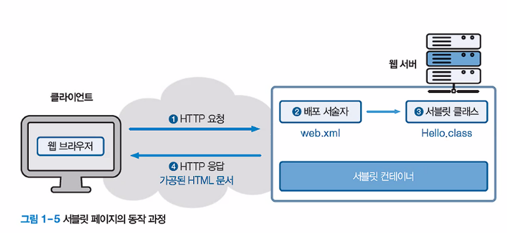
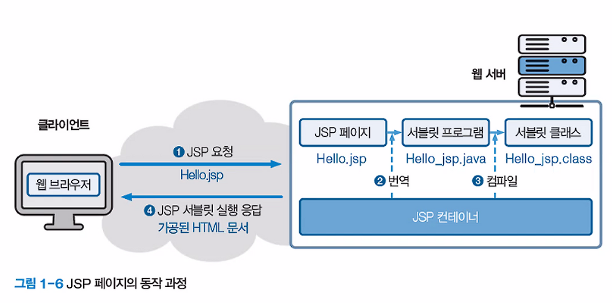

# JSP - Web Programming

## 목차
1. [정적 웹페이지](#1-정적-웹페이지)
   - [개념](#개념)
   - [특징](#특징)
   - [장점](#장점)
   - [단점](#단점)
   - [사용 사례](#사용-사례)

2. [동적 웹페이지](#2-동적-웹페이지)
   - [개념](#개념-1)
   - [특징](#특징-1)
   - [장점](#장점-1)
   - [단점](#단점-1)
   - [사용 사례](#사용-사례-1)

3. [서블릿 (Servlet)](#3-서블릿-servlet)
   - [개념](#개념-2)
   - [특징](#특징-2)
   - [생명주기](#생명주기)
   - [장점](#장점-2)
   - [단점](#단점-2)
   - [기본 구조](#기본-구조)
 

4. [JSP (JavaServer Pages)](#4-jsp-javaserver-pages)
   - [개념](#개념-3)
   - [특징](#특징-3)
   - [JSP 구성 요소](#jsp-구성-요소)
   - [장점](#장점-3)
   - [단점](#단점-3)
   - [기본 구조](#기본-구조-1)
   - [생명 주기](#생명-주기)

5. [정적 vs 동적 웹페이지 비교](#5-정적-vs-동적-웹페이지-비교)
6. [서블릿 vs JSP 비교](#6-서블릿-vs-jsp-비교)
7. [현대 웹 개발에서의 활용](#7-현대-웹-개발에서의-활용)

---

## 1. 정적 웹페이지

### 개념
정적 웹페이지는 서버에 미리 저장된 파일을 그대로 클라이언트에게 전송하는 웹페이지입니다. HTML, CSS, JavaScript 파일로 구성되며, 서버 측에서 별도의 처리 없이 파일 내용이 그대로 브라우저에 전달됩니다.

### 특징
- 서버에 저장된 파일을 그대로 전송
- 모든 사용자에게 동일한 내용 제공
- 파일 내용 변경 시 직접 수정 필요
- 클라이언트 측에서만 상호작용 가능

### 장점
- **빠른 로딩 속도**: 서버 처리가 불필요하여 응답 시간이 빠름
- **간단한 구조**: 개발과 유지보수가 쉬움
- **낮은 서버 부하**: 단순 파일 전송으로 서버 리소스 사용량이 적음
- **보안성**: 서버 측 스크립트가 없어 보안 취약점이 적음
- **캐싱 효율성**: CDN과 브라우저 캐싱 활용이 용이함

### 단점
- **개인화 불가**: 사용자별 맞춤 콘텐츠 제공 어려움
- **실시간 데이터 처리 불가**: 데이터베이스 연동이나 동적 콘텐츠 생성 불가
- **상호작용 제한**: 복잡한 사용자 상호작용 구현 어려움
- **콘텐츠 관리**: 페이지 수가 많을 경우 관리가 복잡함

---

## 2. 동적 웹페이지

### 개념
동적 웹페이지는 사용자 요청에 따라 서버에서 실시간으로 HTML 콘텐츠를 생성하여 전송하는 웹페이지입니다. 데이터베이스, 사용자 입력, 서버 상태 등에 따라 다른 내용을 표시할 수 있습니다.

### 특징
- 서버 측에서 실시간 콘텐츠 생성
- 사용자별, 요청별로 다른 내용 제공
- 데이터베이스와 연동 가능
- 서버 측 프로그래밍 언어 사용 필요

### 장점
- **개인화**: 사용자별 맞춤 콘텐츠 제공
- **실시간 데이터**: 최신 정보를 동적으로 표시
- **상호작용성**: 복잡한 사용자 인터페이스 구현 가능
- **데이터베이스 연동**: 대용량 데이터 관리 및 활용
- **비즈니스 로직**: 복잡한 계산과 처리 로직 구현

### 단점
- **느린 응답**: 서버 처리 시간으로 인한 지연
- **높은 서버 부하**: CPU, 메모리 사용량 증가
- **복잡한 개발**: 서버 측 프로그래밍 지식 필요
- **보안 위험**: 서버 측 스크립트로 인한 보안 취약점
- **캐싱 어려움**: 동적 콘텐츠로 인한 캐싱 효율성 저하
---

## 3. 서블릿 (Servlet)

### 개념
서블릿은 웹 서버에서 실행되는 자바 프로그램으로, HTTP 요청을 처리하고 동적인 웹 콘텐츠를 생성하는 서버 측 기술입니다. Java EE 스펙의 일부로 웹 애플리케이션 개발의 기본 구성 요소입니다.

### 특징
- 자바 클래스로 구현
- 웹 컨테이너(서블릿 컨테이너)에서 실행
- HTTP 프로토콜을 기반으로 동작
- 멀티스레딩 지원으로 동시 요청 처리

### 생명주기
1. **로딩 및 인스턴스화**: 서블릿 클래스 로드 및 인스턴스 생성
2. **초기화**: `init()` 메소드 호출로 초기화 작업 수행
3. **서비스**: `service()` 메소드를 통해 요청 처리 (`doGet()`, `doPost()` 등)
4. **소멸**: `destroy()` 메소드 호출로 정리 작업 후 인스턴스 제거

### 장점
- **성능**: 한 번 로드된 후 메모리에 상주하여 빠른 처리
- **플랫폼 독립성**: 자바의 "Write Once, Run Anywhere" 특성
- **확장성**: 상속과 인터페이스를 통한 확장 가능
- **안정성**: 자바의 메모리 관리와 예외 처리 기능
- **재사용성**: 객체 지향 설계로 코드 재사용 용이

### 단점
- **복잡한 HTML 출력**: HTML을 자바 코드로 작성해야 함
- **개발 효율성**: UI 변경 시 컴파일과 재배포 필요
- **디자인 분리 어려움**: 프레젠테이션과 비즈니스 로직 혼재

### 기본 구조
```java
public class HelloServlet extends HttpServlet {
    @Override
    public void init() throws ServletException {
        // 초기화 코드
    }
    
    @Override
    protected void doGet(HttpServletRequest request, 
                        HttpServletResponse response) 
                        throws ServletException, IOException {
        // GET 요청 처리
        response.setContentType("text/html");
        PrintWriter out = response.getWriter();
        out.println("<html><body>");
        out.println("<h1>Hello Servlet!</h1>");
        out.println("</body></html>");
    }
    
    @Override
    public void destroy() {
        // 정리 코드
    }
}
```

---

## 4. JSP (JavaServer Pages)

### 개념
JSP는 HTML 내에 자바 코드를 삽입하여 동적인 웹페이지를 생성하는 기술입니다. 서블릿의 단점을 보완하기 위해 개발되었으며, 웹 디자이너와 개발자 간의 협업을 용이하게 합니다.

### 특징
- HTML과 자바 코드의 혼합
- 서블릿으로 자동 변환되어 실행
- 태그 기반의 간편한 문법
- 표현식, 스크립틀릿, 선언부 등 다양한 요소 제공

### JSP 구성 요소
- **디렉티브**: `<%@ %>` - 페이지 정보 설정
- **선언부**: `<%! %>` - 변수, 메소드 선언
- **스크립틀릿**: `<% %>` - 자바 코드 실행
- **표현식**: `<%= %>` - 값 출력
- **액션 태그**: `<jsp:action>` - 특별한 기능 수행
- **EL**: `${}` - Expression Language
- **JSTL**: JSP Standard Tag Library

### 장점
- **개발 편의성**: HTML 기반으로 직관적인 개발
- **디자인 분리**: 프레젠테이션과 로직의 분리 가능
- **빠른 개발**: 서블릿보다 간단한 구문
- **재사용성**: 커스텀 태그와 include 기능
- **유지보수**: HTML과 유사한 구조로 수정 용이

### 단점
- **성능**: 서블릿보다 약간의 오버헤드
- **디버깅**: 복잡한 구조에서 디버깅 어려움
- **로직 혼재**: 잘못 사용 시 비즈니스 로직과 뷰 로직 혼재

### 기본 구조

```jsp
<%@ page language="java" contentType="text/html; charset=UTF-8" %>
<!DOCTYPE html>
<html>
<head>
    <title>JSP Example</title>
</head>
<body>
    <%
        String message = "Hello JSP!";
        java.util.Date now = new java.util.Date();
    %>
    <h1><%= message %></h1>
    <p>Current time: <%= now %></p>
    
    <jsp:include page="header.jsp" />
    
    <c:if test="${not empty user}">
        <p>Welcome, ${user.name}!</p>
    </c:if>
</body>
</html>
```

### 생명 주기
 
SP는 서블릿으로 변환되어 실행되므로, 서블릿과 유사하지만 고유한 생명주기를 가집니다.
#### 1단계: 번역 (Translation)
- JSP 파일이 서블릿 자바 소스 코드(.java)로 변환
- JSP 엔진이 JSP 파일을 파싱하여 서블릿 코드 생성
- HTML은 `out.write()` 형태로, JSP 코드는 해당 자바 코드로 변환

#### 2단계: 컴파일 (Compilation)
- 생성된 자바 소스 코드가 바이트코드(.class)로 컴파일
- 자바 컴파일러(javac)에 의해 실행
- 컴파일 에러 발생 시 JSP 실행 중단

#### 3단계: 클래스 로딩 (Class Loading)
- 컴파일된 서블릿 클래스가 JVM에 로드
- 클래스로더가 바이트코드를 메모리에 적재

#### 4단계: 인스턴스화 (Instantiation)
- 로드된 클래스의 인스턴스(객체) 생성
- 서블릿 컨테이너가 객체를 생성하고 관리

#### 5단계: 초기화 (Initialization)
- `jspInit()` 메소드 호출
- 한 번만 실행되며, JSP 페이지의 초기화 작업 수행
- 데이터베이스 연결, 설정 파일 읽기 등

#### 6단계: 서비스 (Service)
- `_jspService()` 메소드 호출
- 클라이언트 요청마다 실행
- HTTP 요청을 처리하고 응답 생성
- JSP의 모든 코드가 이 메소드 내에서 실행

#### 7단계: 소멸 (Destruction)
- `jspDestroy()` 메소드 호출
- JSP가 메모리에서 제거되기 전 실행
- 리소스 정리, 연결 해제 등

### 생명주기 관련 메소드

```jsp
<%!
    // jspInit() - 초기화 메소드
    public void jspInit() {
        System.out.println("JSP 초기화 완료");
        // 초기화 코드 (한 번만 실행)
    }
    
    // jspDestroy() - 소멸 메소드
    public void jspDestroy() {
        System.out.println("JSP 소멸 준비");
        // 정리 코드 (소멸 시 한 번 실행)
    }
%>
```

### 생명주기 특징
- **번역과 컴파일**: JSP가 처음 요청되거나 수정될 때만 수행
- **초기화**: JSP 인스턴스당 한 번만 실행
- **서비스**: 매 요청마다 실행 (멀티스레딩)
- **소멸**: 서버 종료 시나 JSP 언로드 시 실행
- **캐싱**: 한 번 컴파일된 JSP는 메모리에 캐시되어 재사용
---

## 5. 정적 vs 동적 웹페이지 비교

| 구분 | 정적 웹페이지 | 동적 웹페이지 |
|------|-------------|-------------|
| **콘텐츠** | 고정된 내용 | 실시간 생성 |
| **응답 속도** | 빠름 | 상대적으로 느림 |
| **서버 부하** | 낮음 | 높음 |
| **개발 복잡도** | 낮음 | 높음 |
| **개인화** | 불가능 | 가능 |
| **데이터베이스 연동** | 불가능 | 가능 |
| **사용자 상호작용** | 제한적 | 풍부함 |
| **유지보수** | 단순 | 복잡 |
| **보안** | 상대적으로 안전 | 취약점 존재 |
| **비용** | 저렴 | 상대적으로 비싼 |

---

## 6. 서블릿 vs JSP 비교

| 구분 | 서블릿 | JSP |
|------|-------|-----|
| **개발 방식** | 자바 코드 중심 | HTML 코드 중심 |
| **HTML 출력** | 어려움 | 쉬움 |
| **성능** | 빠름 | 약간 느림 |
| **디버깅** | 쉬움 | 어려움 |
| **비즈니스 로직** | 적합 | 부적합 |
| **프레젠테이션** | 부적합 | 적합 |
| **컴파일** | 명시적 컴파일 | 자동 컴파일 |
| **재사용성** | 높음 | 보통 |
| **학습 곡선** | 가파름 | 완만 |

---

## 7. 현대 웹 개발에서의 활용

### 정적 웹페이지의 부활
- **JAMstack**: JavaScript, APIs, Markup의 조합
- **정적 사이트 생성기**: Gatsby, Next.js, Jekyll 등
- **CDN 활용**: 전 세계 빠른 콘텐츠 배포
- **마이크로프론트엔드**: 정적 자산과 동적 기능의 분리

### 서블릿과 JSP의 현재
- **레거시 시스템**: 기존 엔터프라이즈 애플리케이션에서 여전히 사용
- **Spring Framework**: 서블릿 기반의 현대적 웹 프레임워크
- **마이크로서비스**: 서블릿 기반의 경량화된 서비스
- **REST API**: 서블릿을 이용한 API 서버 구축

### 하이브리드 접근법
- **SPA + API**: 정적 프론트엔드 + 동적 백엔드
- **Server-Side Rendering**: Next.js, Nuxt.js 등
- **Progressive Web Apps**: 정적과 동적의 장점 결합
- **Edge Computing**: CDN에서 동적 처리 수행

### 선택 기준
1. **프로젝트 규모**: 소규모는 정적, 대규모는 동적
2. **사용자 요구사항**: 개인화 필요 시 동적 선택
3. **개발 팀 역량**: 기술 스택과 경험 고려
4. **성능 요구사항**: 속도 우선 시 정적 고려
5. **유지보수성**: 장기적 관리 계획 수립

### 미래 전망
- **서버리스**: 함수 기반의 동적 처리
- **WebAssembly**: 브라우저에서 고성능 계산
- **AI/ML 통합**: 지능형 콘텐츠 생성
- **실시간 협업**: WebSocket과 실시간 기술 활용
